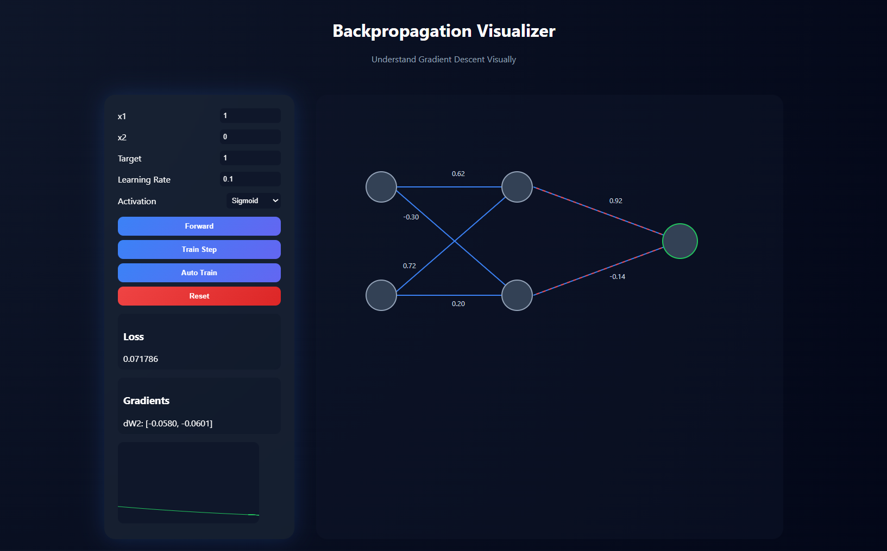

# 📘 Backpropagation — From Basic Concepts to Applied Examples

> While studying neural networks and understanding how learning actually happens,
> I implemented Backpropagation step-by-step for both Regression and Classification problems.

This repository contains hands-on Jupyter Notebook implementations of the **Backpropagation algorithm**, the core learning mechanism behind neural networks.

---

## 🎨 Backpropagation Visualizer

To better understand how gradients flow and how weights update,
a visual representation has been added inside the `Visualizer/` folder.

  

---

## 🧠 What is Backpropagation?

Backpropagation is the algorithm used to train feedforward neural networks.

It works by:
1. Performing **forward propagation** to compute predictions
2. Calculating the **loss**
3. Computing gradients using the **chain rule**
4. Updating weights using **gradient descent**

This repository demonstrates the complete process clearly and mathematically.

---

## 🚀 What You’ll Learn

- Forward Propagation
- Loss Function Computation
- Chain Rule in Action
- Gradient Descent Optimization
- Difference between Regression & Classification training
- How neural networks actually learn internally

